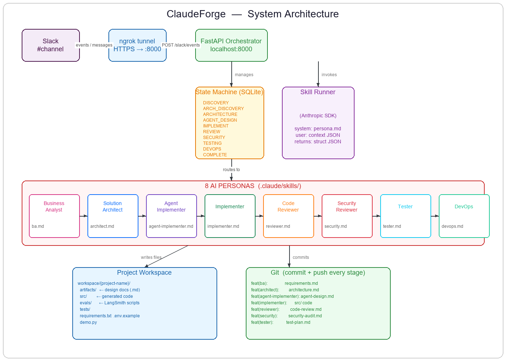

# ClaudeForge

> **An AI Engineering Team built with Claude.**
> Describe what you want to build in Slack. Eight specialized AI personas collaborate to design, build, test, and deploy it — automatically.

---

## 1. Introduction

ClaudeForge is a local-first AI engineering organization powered by Claude. It transforms a single Slack message into a fully built, reviewed, secured, tested, and deployed application.

### The Problem It Solves

Building software requires coordinated expertise — requirements gathering, system design, implementation, code review, security auditing, testing, and deployment. Traditionally these are separate people, separate tools, separate conversations. ClaudeForge unifies them into a single collaborative workflow driven entirely from Slack.

### How It Works

```
You type one message in Slack
         │
         ▼
Business Analyst asks clarifying questions
         │  (you answer in the thread)
         ▼
Requirements captured and approved
         │
         ▼
Architect designs the system, identifies required API keys
         │  (you approve the architecture)
         ▼
Agent Implementer designs the reasoning layer
         │  (you approve the agent design)
         ▼
Implementer writes all code files
         │
         ▼
Code Reviewer audits quality
         │
         ▼
Security Reviewer audits for vulnerabilities
         │
         ▼
Tester writes and runs LangSmith evaluations
         │
         ▼
DevOps deploys locally and posts the live URL
         │
         ▼
App is running. Git history shows every decision made.
```

### What Makes It Different

- **Not a chatbot.** A governed workflow with specialized roles, human approval gates, and automatic progression.
- **Every artifact is committed to Git.** Requirements, architecture, agent design, code review, security audit, test plan — all versioned.
- **The generated app runs.** DevOps installs dependencies, starts the server, health-checks it, and posts the URL to Slack.
- **Recoverable.** If any stage fails, reply `resume` in the thread. Reply `changes` + feedback at any approval gate to revise.

---

## 2. Claude Skills and AI Personas

Each persona is a markdown skill file stored in `.claude/skills/`. It defines the cognitive mode, output contract, and engineering rules for that role. Claude reads the skill as its system prompt and receives the full project context as structured JSON.

---

### Business Analyst — `ba.md`

**Cognitive mode:** Discovery. Transforms vague intent into precise requirements.

**What it does:**
- Runs a dynamic multi-turn discovery loop — asks focused questions one at a time
- Tracks what it knows vs. what is still missing
- Produces a complete requirements document with functional requirements, acceptance criteria, and explicit out-of-scope list
- Asks for user approval before handing off

**Approval gate:** Yes — user must reply `approved` before pipeline continues

**Output artifact:** `artifacts/requirements.md`

---

### Solution Architect — `architect.md`

**Cognitive mode:** Technical discovery + system design.

**What it does:**
- Asks up to 5 focused technical questions — UI preference, stack constraints, API keys needed, deployment environment
- Detects which external API keys the design requires and posts a checklist
- Produces full architecture document: components, tech stack with rationale, data flow, deployment instructions
- Always generates a Mermaid diagram of the system
- If requirements specify a UI (Streamlit, React, HTML), it designs that UI

**Approval gate:** Yes — user must reply `approved` before pipeline continues

**Output artifact:** `artifacts/architecture.md`, `artifacts/architecture.mermaid`

---

### Agent Implementer — `agent-implementer.md`

**Cognitive mode:** Reasoning design. Designs how the AI inside the app thinks.

**What it does:**
- Selects and justifies a reasoning strategy (ReAct, Plan-then-Execute, Chain-of-Thought, etc.)
- Defines every tool the agent has access to with precise input/output contracts
- Designs memory and state strategy
- Defines failure modes and guardrails
- Does not write code — designs the reasoning layer the Implementer will build

**Approval gate:** Yes — user must reply `approved` before pipeline continues

**Output artifact:** `artifacts/agent-design.md`

---

### Implementer — `implementer.md`

**Cognitive mode:** Execution. Turns approved design into working code.

**What it does:**
- First call determines the complete file list from the architecture in dependency order
- Generates each file individually, passing already-written files as context so imports stay consistent
- Follows architecture exactly — builds the UI framework the Architect specified
- Writes `demo.py` — a standalone script that runs the app with a sample input
- Never introduces frameworks or patterns not approved by the Architect

**Approval gate:** None — automatic

**Output artifact:** `src/`, `requirements.txt`, `.env.example`, `demo.py`

---

### Code Reviewer — `reviewer.md`

**Cognitive mode:** Quality audit.

**What it does:**
- Reads every generated source file
- Checks alignment with approved architecture and requirements
- Flags correctness issues, missing error handling, incomplete implementations
- Issues verdict: `APPROVED`, `APPROVED_WITH_CHANGES`, or `REJECTED`
- `REJECTED` loops back to Implementer automatically

**Approval gate:** None — automatic

**Output artifact:** `artifacts/code-review.md`

---

### Security Reviewer — `security.md`

**Cognitive mode:** Adversarial. Audits actual generated code — not design documents.

**What it does:**
- Reads source files from `src/`
- Checks OWASP Top 10: injection, auth issues, data exposure, misconfigurations
- Checks agent-specific risks: prompt injection, tool misuse, runaway loops, key leakage
- All findings are advisory after implementation — pipeline always continues
- Flags HIGH severity findings prominently for DevOps awareness before deployment

**Approval gate:** None — automatic

**Output artifact:** `artifacts/security-audit.md`

---

### Tester — `tester.md`

**Cognitive mode:** Adversarial functional testing using LangSmith.

**What it does:**
- Derives test cases from the requirements acceptance criteria
- Writes `evals/run_evals.py` — a LangSmith evaluation script
- Executes the eval script and posts results to Slack
- Tests happy path, edge cases, failure cases, and adversarial inputs
- Issues verdict: `PASS`, `PASS_WITH_WARNINGS`, or `FAIL`
- `FAIL` loops back to Implementer automatically

**Approval gate:** None — automatic

**Output artifact:** `artifacts/test-plan.md`, `evals/run_evals.py`

---

### DevOps — `devops.md`

**Cognitive mode:** Deployment. Gets the app running locally.

**What it does:**
- Reads architecture and implementation to determine the exact start command
- Installs dependencies in the workspace
- Starts the application process
- Health-checks the running service
- Posts the live URL to Slack
- Posts the complete git history to Slack

**Approval gate:** None — automatic

**Output:** Live app URL posted to Slack

---

## 3. Architecture

### System Diagram



### Pipeline State Machine

```
  IDLE
   │  @Business-Analyst <request>
   ▼
  DISCOVERY_ACTIVE ──────────────────────── BA asks questions
  DISCOVERY_WAITING ─────────────────────── waiting for user reply
  DISCOVERY_APPROVAL_PENDING ─────────────── awaiting: approved / changes
   │
   ▼
  ARCH_DISCOVERY_ACTIVE ──────────────────── Architect asks technical questions
  ARCH_WAITING_FOR_KEYS ──────────────────── Architect lists required API keys
  ARCHITECTURE_ACTIVE ────────────────────── Architect designs system
  ARCHITECTURE_APPROVAL_PENDING ──────────── awaiting: approved / changes
   │
   ▼
  AGENT_DESIGN_ACTIVE ────────────────────── Agent Implementer designs reasoning
  AGENT_DESIGN_APPROVAL_PENDING ──────────── awaiting: approved / changes
   │
   ▼
  IMPLEMENTATION_ACTIVE ──────────────────── Implementer writes code       [AUTO]
   │
   ▼
  REVIEW_ACTIVE ──────────────────────────── Code Reviewer audits          [AUTO]
   │
   ▼
  SECURITY_ACTIVE ────────────────────────── Security Reviewer audits code [AUTO]
   │
   ▼
  TESTING_ACTIVE ─────────────────────────── Tester runs evals             [AUTO]
   │
   ▼
  DEVOPS_ACTIVE ──────────────────────────── DevOps deploys + posts URL    [AUTO]
   │
   ▼
  COMPLETE


  [USER APPROVAL]  =  requires "approved" in Slack thread
  [AUTO]           =  runs automatically, no user input needed
  Any stage        →  reply "resume" to retry after failure
  Any approval     →  reply "changes" + feedback to revise
```

### Orchestrator File Map

```
 orchestrator/
 ├── main.py              FastAPI app · Slack event handler · full pipeline wiring
 ├── state.py             SQLite state machine · project lifecycle · artifact storage
 ├── skill_runner.py      Loads skill prompt · invokes Claude · parses JSON response
 ├── context_builder.py   Assembles context JSON for each skill invocation
 ├── router.py            Parses @mentions · detects approvals · alias mapping
 ├── approval_handler.py  Routes approved / changes / resume responses
 ├── slack_client.py      Persona-aware posting · file uploads · reactions
 ├── workspace_manager.py Creates project directory tree · writes artifacts to disk
 ├── git_helper.py        Commits and pushes after each stage
 └── console.py           Color-coded terminal output for demo visibility
```

### Workspace Layout

```
 workspace/
 └── {project-name}/
     ├── artifacts/
     │   ├── requirements.md           ← Business Analyst
     │   ├── architecture.md           ← Solution Architect
     │   ├── architecture.mermaid      ← Solution Architect
     │   ├── agent-design.md           ← Agent Implementer
     │   ├── implementation-report.md  ← Implementer
     │   ├── code-review.md            ← Code Reviewer
     │   ├── security-audit.md         ← Security Reviewer
     │   └── test-plan.md              ← Tester
     ├── src/                          ← generated application code
     ├── evals/
     │   └── run_evals.py              ← LangSmith evaluations
     ├── tests/
     ├── requirements.txt
     ├── .env.example
     └── demo.py
```

---

## 4. Setup and Install

### Prerequisites

| Requirement | Notes |
|-------------|-------|
| Python 3.12+ | |
| [ngrok](https://ngrok.com) | Free account sufficient |
| Slack workspace | Admin access to create apps |
| Anthropic API key | [console.anthropic.com](https://console.anthropic.com) |
| LangSmith API key | Optional — for eval tracing |

### Step 1 — Clone and Install

```powershell
git clone https://github.com/gandhiraketla/ClaudeCode-AITeam.git
cd ClaudeCode-AITeam
pip install -r requirements.txt
```

### Step 2 — Configure Environment

Create a `.env` file in the project root:

```env
SLACK_BOT_TOKEN=xoxb-...
SLACK_SIGNING_SECRET=...
SLACK_CHANNEL_ID=C...
ANTHROPIC_API_KEY=sk-ant-...
WORKSPACE_BASE_PATH=C:/ClaudeCode-AITeam/workspace
LANGSMITH_API_KEY=...         # optional
LANGCHAIN_TRACING_V2=true     # optional
LANGCHAIN_PROJECT=claudeforge # optional
```

### Step 3 — Create Slack App

1. Go to [api.slack.com/apps](https://api.slack.com/apps) → **Create New App** → From Scratch
2. **Features → OAuth & Permissions → Bot Token Scopes** — add:
   ```
   chat:write
   chat:write.customize
   files:write
   reactions:write
   channels:history
   channels:read
   ```
3. **Features → Event Subscriptions** → Enable Events → Subscribe to bot events:
   ```
   message.channels
   app_mention
   ```
4. **Settings → Install App** → Install to Workspace → copy the `xoxb-` Bot Token
5. **Basic Information → App Credentials** → copy the Signing Secret

### Step 4 — Start ngrok

```powershell
ngrok http 8000
```

Copy the forwarding URL — e.g. `https://abc123.ngrok-free.app`

### Step 5 — Configure Slack Event URL

In your Slack app → **Features → Event Subscriptions → Request URL**:

```
https://abc123.ngrok-free.app/slack/events
```

Slack will verify it immediately. You should see a green **Verified** checkmark.

### Step 6 — Start ClaudeForge

```powershell
python .\run.py
```

Expected output:
```
============================================================
  ClaudeForge - AI Engineering Team
  HTTP Mode | Ready for messages
============================================================
```

### Step 7 — Invite Bot to Channel

In your Slack channel:
```
/invite @claudeforge
```

### Step 8 — Build Something

Post in Slack:
```
@Business-Analyst I want to build a CSV Insights Generator web app
```

Reply `approved` at each approval gate. Reply `changes` + feedback to revise. Reply `resume` if anything fails.

---

## Troubleshooting

| Symptom | Fix |
|---------|-----|
| Pipeline stuck in a state | Reply `resume` in the Slack thread |
| ngrok URL changed on restart | Update Request URL in Slack Event Subscriptions |
| "Missing API keys" warning | Add keys to `.env`, reply `ready` in thread — pipeline continues regardless |
| Port 8000 already in use | `Get-Process python \| Stop-Process -Force` |
| No events arriving from Slack | Confirm `/invite @claudeforge` in channel · verify ngrok forwards to port 8000 · check Event Subscriptions shows `message.channels` |
| Bot posts but nothing happens | Check Terminal 1 for error output · reply `resume` in thread |
