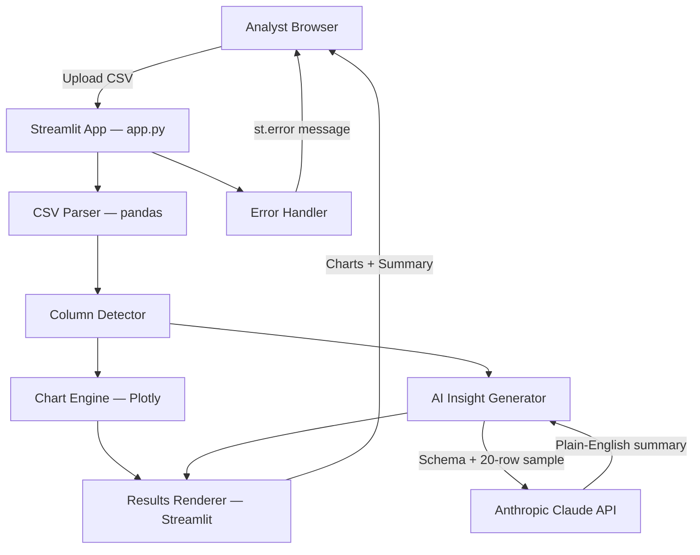

# Architecture Document

## Components
- CSV Uploader — Streamlit file_uploader widget, accepts .csv up to 10MB
- CSV Parser & Column Detector — pandas-based type inference (numeric, categorical, date)
- Chart Engine — auto-selects chart types per column profile, renders via Plotly
- AI Insight Generator — sends column schema + sample rows to Claude API, returns plain-English summary
- Results Renderer — Streamlit layout rendering charts + insight summary side-by-side
- Error Handler — catches malformed/empty CSV and displays user-friendly messages

## Tech Stack
- **frontend_and_server**: Streamlit 1.35.0
- **data_processing**: pandas 2.2.2
- **charting**: Plotly 5.22.0
- **ai_client**: anthropic 0.28.0 (Claude 3 Haiku for speed/cost)
- **env_management**: python-dotenv 1.0.1
- **runtime**: Python 3.11

## Data Flow
1) Analyst uploads CSV via Streamlit file_uploader. 2) pandas reads the file; Column Detector infers each column's type (numeric, categorical, date) and computes basic stats (min, max, nunique, nulls). 3) Chart Engine applies heuristics: date+numeric -> line chart, categorical+numeric -> bar chart, categorical with <=6 values -> pie chart; Plotly figures are built in-memory. 4) AI Insight Generator constructs a prompt containing column names, inferred types, and a 20-row sample (truncated to stay within token limits); sends to Claude claude-3-haiku-20240307 via Anthropic SDK; receives plain-English summary. 5) Streamlit renders all Plotly charts and the AI summary in a single-page layout with a spinner shown during steps 2-4. 6) Any exception (bad CSV, API error) is caught and shown as a st.error message.

## Deployment
Local only. Single process: `streamlit run app.py` on port 8501. Requires ANTHROPIC_API_KEY in .env at project root. Dependencies installed via `pip install -r requirements.txt`. No database, no background workers, no Docker required.

## Diagram

