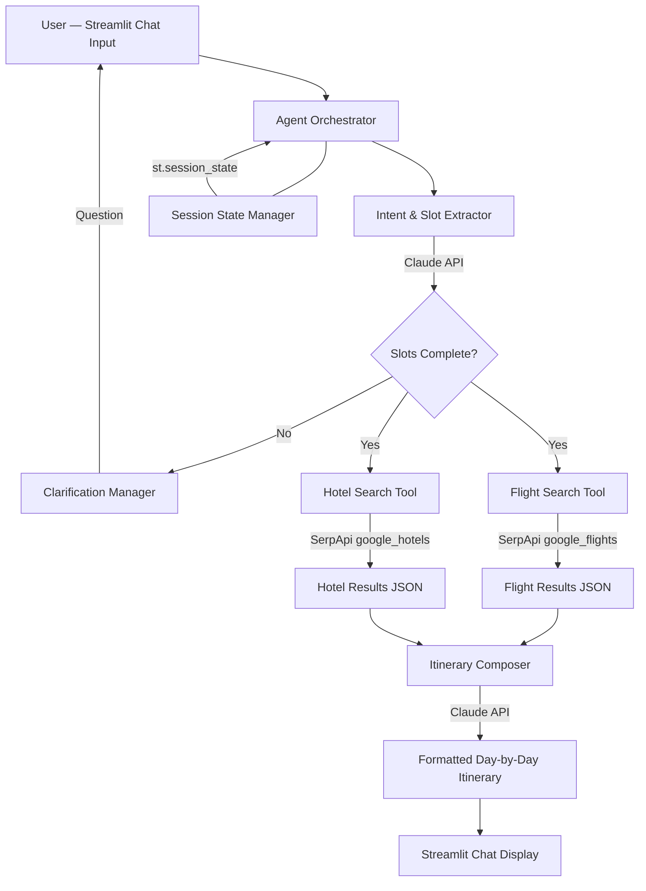

# Architecture Document

## Components
- Streamlit Chat UI — renders conversation, displays structured itinerary cards
- Agent Orchestrator — parses intent, manages clarification loop, sequences tool calls
- Intent & Slot Extractor — uses Claude to identify intent and extract travel params
- Clarification Manager — detects missing required slots and generates follow-up questions
- Flight Search Tool — calls SerpApi google_flights engine, returns parsed options
- Hotel Search Tool — calls SerpApi google_hotels engine, returns parsed options
- Itinerary Composer — uses Claude to assemble day-by-day plan from tool results
- Session State Manager — holds conversation history and collected slots in st.session_state

## Tech Stack
- **UI**: Streamlit 1.35
- **LLM**: Anthropic Claude claude-opus-4-5 via anthropic 0.28
- **Flight & Hotel Data**: SerpApi Python client 0.1.5 — google_flights + google_hotels engines
- **Env Management**: python-dotenv 1.0
- **HTTP**: httpx 0.27 (used internally by SerpApi client)
- **Language**: Python 3.11

## Data Flow
User types a message in Streamlit chat input. The message plus conversation history is sent to the Agent Orchestrator. The Intent & Slot Extractor calls Claude to classify intent (full itinerary, flights-only, hotels-only) and extract slots (origin, destination, dates, travelers, budget). If required slots are missing, the Clarification Manager generates a follow-up question returned to the UI. Once slots are complete, the Orchestrator invokes the Flight Search Tool and/or Hotel Search Tool in parallel via SerpApi, receiving structured JSON results. The Itinerary Composer sends those results plus user preferences to Claude, which produces a formatted day-by-day markdown itinerary. The result is streamed back to the Streamlit UI and rendered as a structured chat message. All state (slots, history, results) lives in st.session_state for the session duration.

## Deployment
Single process, local. Run: `pip install -r requirements.txt` then `streamlit run app.py`. App serves on http://localhost:8501. Requires .env file with SERPAPI_API_KEY and ANTHROPIC_API_KEY. No separate server or database. All state is in-memory per browser session.

## Diagram

